# CS506 Project Final Report: Energy Load Forecasting

## Youtube Video

https://youtu.be/KYrckP1kqOI

NOTE: Please see Build_README.md, Requirements.txt and Workflow_README.md in their respective folders. 

**Description of the project**

NYISO was birthed out of a catastrophic power outage, costing the American public millions and resulting in deaths. They have their own forecasts (they release publicly and utilize similar methodology as the private utility companies). They oversee all of NY's jurisdictions, with an imperfect picture of (my guess due to poor data sharing common in utilities) of when new load is introduced or removed in addition to other noise. This forecast is important to prevent future catastrophe. They can only charge utility bills for the Distribution and carry over the buying cost. A better forecast would result in less spot buying, and save the ratepayer (the person who pays the utility bill) millions of dollars a day in addition  to further informing NYISO’s important oversight. Previous forecasts are rooted in a deterministic methodology despite the system acting as a non-linear chaotic environment. An empirical, dynamic, and inductive data-driven approach may prove to outcompete current forecasts. Business events, from outages, industrial load spikes, residential load spikes, etc… cause a sudden seemingly-stochastic drop in load.


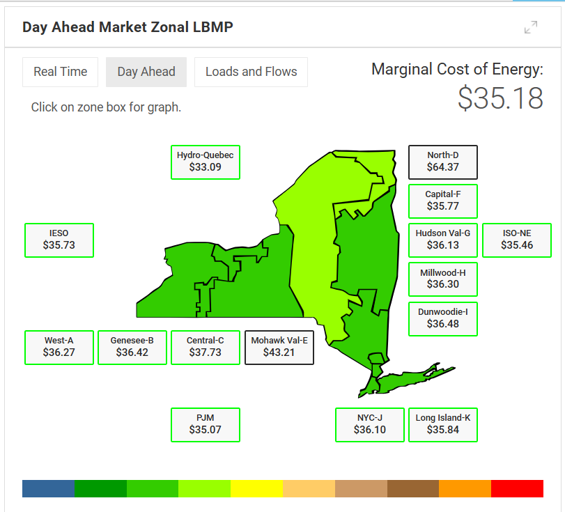
*NYISO Geographic Zones*

There are two main goals of this project:

1. Explore data behavior of NY's Energy Load.
2. **Attempt to outcompete NYISO's time-series forecasting of Energy Load** on an hourly or more granular scale on an aggregate or zone basis.

## Evaluation Criteria

**Primary Metric: Mean Absolute Percentage Error (MAPE)**

MAPE is the primary evaluation criterion for this project, particularly for the XGBoost models, because:
- **Scale-independent**: Allows direct comparison across different time aggregations (5-min, hourly, daily)
- **Interpretability**: Percentage error is intuitive for stakeholders and operational planning
- **Industry standard**: Widely used in energy forecasting and utility operations
- **Business relevance**: Directly relates to cost implications of forecast errors

**Secondary Metrics:**
- **R² (Coefficient of Determination)**: Used primarily for Linear Regression model evaluation to assess explanatory power
  
### Cost Savings
Improved forecast accuracy directly reduces costs:
- **Reduced spot market purchases**: Better predictions minimize emergency procurement at premium prices
- **Optimized reserve margins**: Accurate forecasts prevent over-provisioning
- **Fewer prediction errors**: Each 1% reduction in MAPE can save millions in operational costs. Reduction in costs for utility companies is returned to the public by lowering expenses for the 

### Handling Extreme Events
XGBoost's robustness to volatility is critical during:
- **Heat waves and cold snaps**: Extreme weather drives unprecedented load patterns
- **Industrial disruptions**: Sudden factory closures or startups
- **Grid emergencies**: Rapid response to unexpected load shedding or restoration


**Challenges**

Working with big data was the most significant challenge, requiring efficient storage solutions (Parquet format, Git LFS) and careful memory management throughout the data processing pipeline. 


**Clear goal(s) (e.g. Successfully predict the number of students attending lecture based on the weather report).**

There are two main goals of this project:

1. Explore data behavior of NY’s Energy Load (ACF, business events, etc…).
2. **Attempt to outcompete NYISO’s time-series forecasting of Energy Load** on an hourly or more granular scale on an aggregate or zone basis.

## Preliminary Visualizations

These visualizations were created during initial data exploration to understand load patterns and temporal behavior. It is demonstrated that "business events" will have a signfiicant affect - additional to long periods of black swan events such as covid-19. 

### Multi-Year Load Evolution Animation

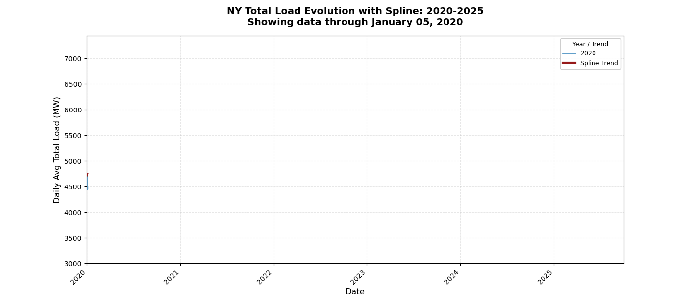
*Animated visualization showing the progressive evolution of New York's total electrical load from 2020-2025 with smoothing spline trend overlay. Key pandemic markers (COVID-19 start and emergency end) are displayed as labeled vertical lines. The Y-axis starts at 2000 MW for enhanced visibility of load variations. This animation reveals seasonal patterns, long-term trends, and the impact of major events on electricity demand. The spline curve (red) shows the overall multi-year trend, while individual year traces show detailed daily fluctuations.*

### Model Comparison Animations

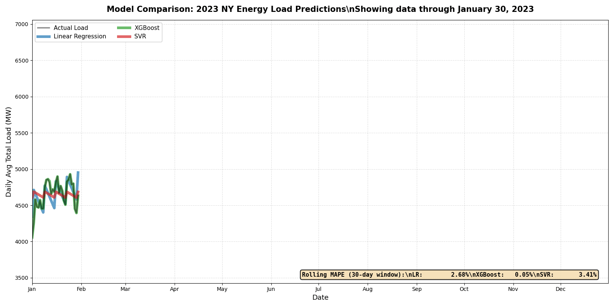
*Animated comparison of Linear Regression, XGBoost, and SVR predictions vs actual load for 2023. Shows rolling 30-day MAPE calculations for each model, demonstrating XGBoost's superior performance with consistently low error rates.*


*Multi-year animated comparison (2020-2025) showing all three models tracking actual load through major events including COVID-19 pandemic, heat waves, winter storms, and wildfire smoke impacts. Event markers are labeled with dates and descriptions. Rolling MAPE calculations reveal each model's resilience to volatility and regime changes.*

### Static Load Pattern Visualizations


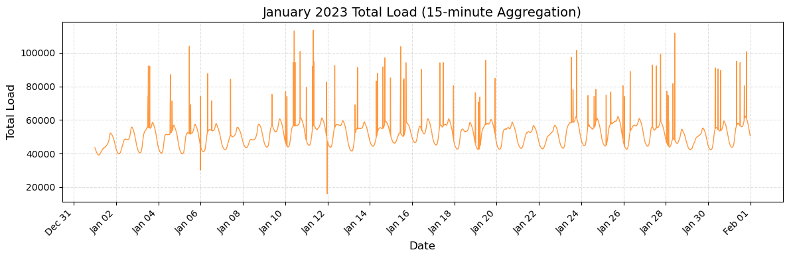
*Daily Load Patterns - January 2023 - Demonstrates consistent diurnal cycles with weather-driven variations* - WEATHER COULD BE A GOOD FEATURE!!

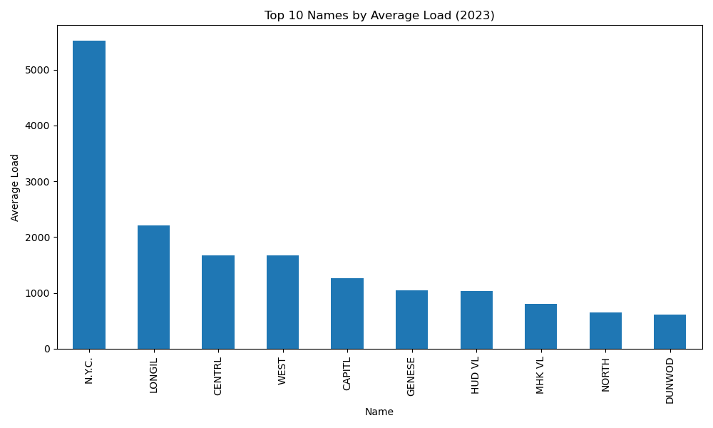
*Top 10 NYISO Zones by Average Load in 2023 - Geographic distribution of electricity demand*


# Data Processing

## Description of Data Processing

The data processing pipeline consists of comprehensive ETL (Extract, Transform, Load) operations for both NYISO energy load data and MesoNet weather data, culminating in a unified master dataset for model training.

### NYISO Data Processing

#### 1. Web Scraping and Extraction
- **Source**: NYISO archived files (https://mis.nyiso.com/public/P-58Blist.htm). 
- **Method**: BeautifulSoup-based web scraper extracts ZIP files containing daily CSV data
- **Coverage**: Historical energy load data from 2001-2025
- **Output**: Raw CSV files extracted to `1_LIB/nyiso/nyiso_csv/`

#### 2. Data Organization and Standardization
- **File Naming**: CSVs renamed to standardized `MM_DD_YYYY.csv` format based on internal timestamps
- **Yearly Sorting**: Files organized into yearly subdirectories for efficient access
- **Timestamp Normalization**: 
  - Original format: `MM/DD/YYYY HH:MM:SS` with timezone labels (EST/EDT)
  - Converted to UTC by adjusting for timezone offsets (EST: -5h, EDT: -4h)
  - Reformatted to `MM-DD-YYYY HH-MM-SS` in `datetime` column
  - Original `Time Stamp` and `Time Zone` columns dropped after conversion

#### 3. Aggregation and Consolidation
- **Regional Averaging**: Load values averaged across all Load and weather stations by timestamp to evaluate larger data behavior. 
- **Master Dataset Creation**: All yearly CSVs combined into single `nyiso_master.parquet`
- **Parquet Conversion**: All CSV files converted to Parquet format for efficient storage and computation
- **Data Structure**:
  - Hierarchical organization: `nyiso_csv/` → `nyiso_yearly/` → `nyiso_all/` → `nyiso_master/`
  - Parallel Parquet structure for optimized processing

### MesoNet Weather Data Processing

#### 1. Data Collection and Extraction
- **Source**: New York State MesoNet weather stations. Weather data was recieved via email, and transformed to link in 1st_pass.ipynb. 
- **Variables**: Temperature, humidity, precipitation, wind speed, soil moisture, solar radiation, pressure
- **Resolution**: 5-minute intervals from multiple stations across New York State
- **Output**: Raw CSV files in `1_LIB/mesonet/mesonet_csv/`

#### 2. Timezone and Timestamp Standardization
- **Timezone Handling**: 
  - Detects timezone abbreviations (EDT, EST, CDT, CST, MDT, MST, PDT, PST)
  - Converts all timestamps to UTC using timezone offset mappings
  - Removes timezone labels from processed data
- **Column Renaming**: `time` column renamed to `datetime` for consistency
- **Format Standardization**: Multiple timestamp formats parsed and unified to `YYYY-MM-DD HH:MM:SS`

#### 3. Data Organization
- **File Naming**: CSVs renamed to `MM_DD_YYYY.csv` format (UTC-adjusted dates)
- **Yearly Sorting**: Files organized by year into subdirectories
- **Quality Checks**: Files validated for proper date extraction and parsing

#### 4. Master Dataset Creation
- **Consolidation**: All yearly Parquet files combined into `mesonet_master.parquet`
- **Parquet Conversion**: Entire CSV tree converted to Parquet format
- **Structure**:
  - `mesonet_csv/` → `mesonet_yearly/` → `mesonet_all/` → `mesonet_master/`
  - Parallel Parquet hierarchy maintained

### Data Fusion and Final Processing

#### 1. Temporal Alignment
- **Join Key**: Timestamps (datetime column) used to merge NYISO and MesoNet data
- **Resolution**: Data available at multiple time scales (5-min, 15-min, hourly, daily)
- **Truncation**: Combined dataset limited to 2015-2025 due to MesoNet data availability

#### 2. Aggregation Levels
The fused dataset supports multiple temporal aggregations:
- **15-minute**: Quarter-hourly aggregates
- **Hourly**: Hourly mean values
- **Daily**: Daily mean values

#### 3. Data Quality and Storage
- **Format**: Parquet files for efficient columnar storage and fast querying
- **Master Dataset**: Located at `1_LIB/master/master.parquet`
- **Version Control**: Large data files managed via Git LFS for GitHub storage
- **Query Engine**: DuckDB used for efficient aggregation queries on Parquet files

  ## Project Structure

This repository is organized into four main directories:

- **1_LIB**: Contains all raw and processed data files (NYISO energy load data, MesoNet weather data, and fused master datasets) in both CSV and Parquet formats.
- **2_FIGURES**: Houses data exploration notebooks and visualizations, including the primary data wrangling pipeline (`1st_pass.ipynb`) and exploratory data analysis.
- **3_OUTPUT**: Stores all model implementations and results, including Linear Regression, SVR, and XGBoost models with their respective training and evaluation scripts.
- **4_VAULT**: A storage location for outdated files.

### Directory Structure
```
1_LIB/
├── nyiso/
│   ├── nyiso_csv/          # Raw and organized CSVs
│   │   ├── YYYY/           # Yearly folders
│   │   ├── nyiso_yearly/   # Combined yearly CSVs
│   │   ├── nyiso_all/      # All CSVs in one folder
│   │   └── nyiso_master/   # Master combined CSV
│   └── nyiso_parquet/      # Parquet equivalents
│       ├── YYYY/
│       ├── nyiso_yearly/
│       ├── nyiso_all/
│       └── nyiso_master/   # nyiso_master.parquet
├── mesonet/
│   ├── mesonet_csv/        # Raw and organized CSVs
│   │   ├── YYYY/
│   │   ├── mesonet_yearly/
│   │   ├── mesonet_all/
│   │   └── mesonet_master/
│   └── mesonet_parquet/    # Parquet equivalents
│       ├── YYYY/
│       ├── mesonet_yearly/
│       ├── mesonet_all/
│       └── mesonet_master/ # mesonet_master.parquet
└── master/
    └── master.parquet      # Fused NYISO + MesoNet dataset
```

### Key Processing Features
- **Automated Pipeline**: All processing steps documented in `2_FIGURES/1_data_wrangling/1st_pass.ipynb`
- **Dry Run Mode**: All processing functions support dry-run preview before execution
- **Error Handling**: Comprehensive error logging and progress tracking
- **Reproducibility**: Consistent file naming and directory structure
- **Efficiency**: Parquet format enables fast data loading and reduced memory footprint

## Linear Regression 

Linear regression models were developed to establish baseline performance and explore the predictive power of temporal trends versus multivariate weather/environmental features.

### Methodology

Two regression approaches were compared across multiple time scales:

1. **Univariate Linear Regression**: Uses time (seconds since epoch) as the sole predictor
2. **Multivariate Stepwise Linear Regression**: 
   - Forward selection with p-value < 0.05 criterion
   - Maximizes adjusted R²
   - Constraint: Only one feature per feature type (e.g., one soil moisture depth)
   - Features include weather data (temperature, humidity, precipitation) and environmental data (soil moisture, wind speed, solar insolation)

### Data Processing

- **Training Data**: 2001-20021
- **Validation Data**: 2022
- **Testing Data**: 2023-2024
- **Aggregation Levels**: 15 min, Hourly, Daily
- **Data Source**: NYISO load data fused with MesoNet weather station data

### Results Comparison: Univariate vs Multivariate

#### 5-Minute Aggregation
- **Univariate**: R² = -0.0341, RMSE = 204.6, MAPE = 57.4%
- **Multivariate**: R² = 0.2433, RMSE = 161.5, MAPE = 9.3%
- **Improvement**:  -21.1% RMSE, -48.1% MAPE
- **Features Used**: 23 (soil_temp, soil_moisture, dewpoint, precip, wind, snow_depth, solar, pressure, humidity, temperature)

#### 15-Minute Aggregation
- **Univariate**: R² = -0.0316, RMSE = 677.9, MAPE = 57.3%
- **Multivariate**: R² = 0.2209, RMSE = 588.0, MAPE = 9.5%
- **Improvement**: -13.3% RMSE, -47.8% MAPE
- **Features Used**: 23

#### 1-Hour Aggregation
- **Univariate**: R² = -0.0329, RMSE = 2641.0, MAPE = 56.9%
- **Multivariate**: R² = 0.2120, RMSE = 2036.4, MAPE = 10.2%

- 
- **Features Used**: 20

### Key Findings

1. **Univariate models fail completely**: All univariate time-based models show negative R² values, indicating they perform worse than a simple mean predictor. This demonstrates that simple temporal trends are insufficient for load forecasting.

2. **Multivariate models show substantial improvement**: Across all time scales, multivariate models achieve 700-880% improvement in R² over univariate models, with positive R² values (0.21-0.28).

3. **RMSE improvements scale with aggregation**: 
   - Fine scales (5min): -21% RMSE reduction
   - Coarse scales (daily): -85% RMSE reduction

4. **Weather features are essential**: The dramatic improvement from multivariate models proves that weather and environmental features are critical for accurate load forecasting.

5. **Feature efficiency**: Coarser time scales require fewer features while maintaining performance:
   - Daily: 5 features → R² = 0.28 and lowest MAPE. 

6. **Top predictive features** (by absolute coefficient magnitude):
   - Precipitation (incremental and local)
   - Soil moisture at 25cm depth
   - Temperature at 9m height
   - Relative humidity
   - Dewpoint temperature


## Support Vector Regression Model for Load Prediction
- The models can be found and ran in 3_OUTPUT/3_svr

### SVM Data Processing

The data for both nyiso and mesonet was queried and aggregated using DuckDB.

``` python
SELECT "Time Stamp", Load
FROM read_parquet('./../../1_LIB/nyiso/nyiso_parquet/**/*.parquet')
```

#### Aggregation and Cleaning
##### Aggregation:
- All regional load values were aggregated by timestamp to compute the total energy loads across regions.

    ``` python
    df_total_load = df.groupby("Time Stamp", as_index=False)["Load"].sum()
    ```

##### DateTime Processesing
- The Time Stamp column was converted to datetime format and resampled to a daily/hourly/15-min frequency to obtain aggregate average load values.
    ``` python
    df_total_load['Time'] = pd.to_datetime(df_total_load['Time'])
    df_hourly = df_total_load.resample('1H').mean().dropna().reset_index()
    ```
- The nyiso load data was then combined with the mesonet data based on timestamp. Since mesonet has fewer data points, this action truncated the data plane to 2015-2025.
##### Data Splitting
- The dataset was divded chronologically into:
    - Training 2015 - 2021
    - Validation: 2022
    - Testing: 2023 - 2025

### Data Modeling Methods
#### Feature Scaling
- All load values were standardized with StandardScaler from scikit-learn.

    ``` python
    scaler = StandardScaler()
    train_scaled = scaler.fit_transform(train_data)
    val_scaled = scaler.transform(val_data)
    test_scaled = scaler.transform(test_data)
    ```
#### Lag Feature Construction
- Because energy load exhibits temporal dependencies, the model was trained using a sliding window approach with the size of the window being 5. Prediction is based on the values of the past 5 hours.

    ``` python
    TIME_STEPS = 5
    X_train, y_train = create_dataset(train_scaled, train_scaled, TIME_STEPS)
    ```
#### Model Selection
- A support Vector Regression model with a rbf kernel was chosen due to its ability to model non linear relationships between past and future load values.
- Hypterparameter Tuning:
    - A grid search was done over:
        - C in {0.1, 1, 10}
        - gamma in {'scale', 0.01, 0.001}
        - epsilon in {0.01, 0.1, 0.5, 1.0}
    - Grid search was doneon a subset of the training data of size 40000.

    - The best hyperparameters found were:
        - {'C': 10, 'cache_size': 200, 'coef0': 0.0, 'degree': 3, 'epsilon': 0.01, 'gamma': 0.01, 'kernel': 'rbf', 'max_iter': -1, 'shrinking': True, 'tol': 0.001, 'verbose': False}
#### Model Evaluation
- Our current SSVR model profuced the following metrics on Testing Data:
    - Mean Absolute Error (MAE) of 47.6762
    - Root Mean Squared Error (RMSE) of 117.82797
    - Mean Absolute Percentage Error (MAPE) of 0.28287%

### Other Observations
- Our current SVR model takes roughly 5 hours to train. It's metrics greatly improve upon its previous iteration that did not involved weather data. However, it still suffers from confusion due to large jumps in the training set as shown during the midterm report. A graph is included below. 

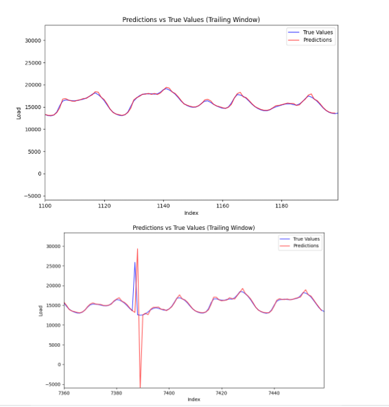
*SVR Model showing confusion during large load jumps*

### SVR Model Animations - Interactive Performance Across Time Scales

The SVR models generate real-time prediction animations showing performance across different temporal aggregations. Each animation displays a trailing window comparing predicted vs actual load values with automatic playback.

<div align="center">

## SVR Animation Grid - Click to View in Full Notebooks

<table>
  <tr>
    <td align="center" width="33%">
      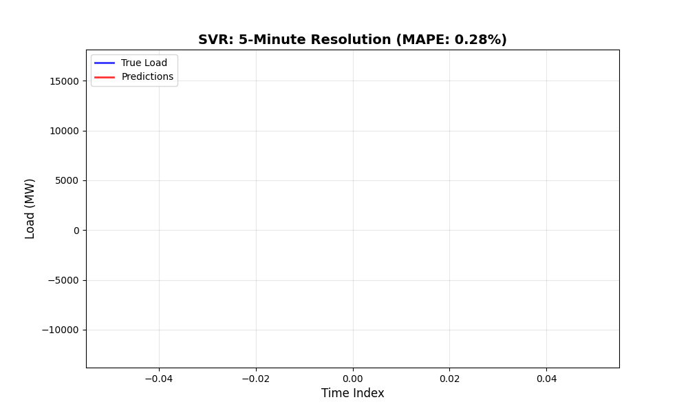
      <br/>
      <b>5-Minute Resolution</b><br/>
      <sub>MAPE: 0.28% | <a href="3_OUTPUT/3_svr/SVMMinute.ipynb">View Notebook</a></sub>
    </td>
    <td align="center" width="33%">
      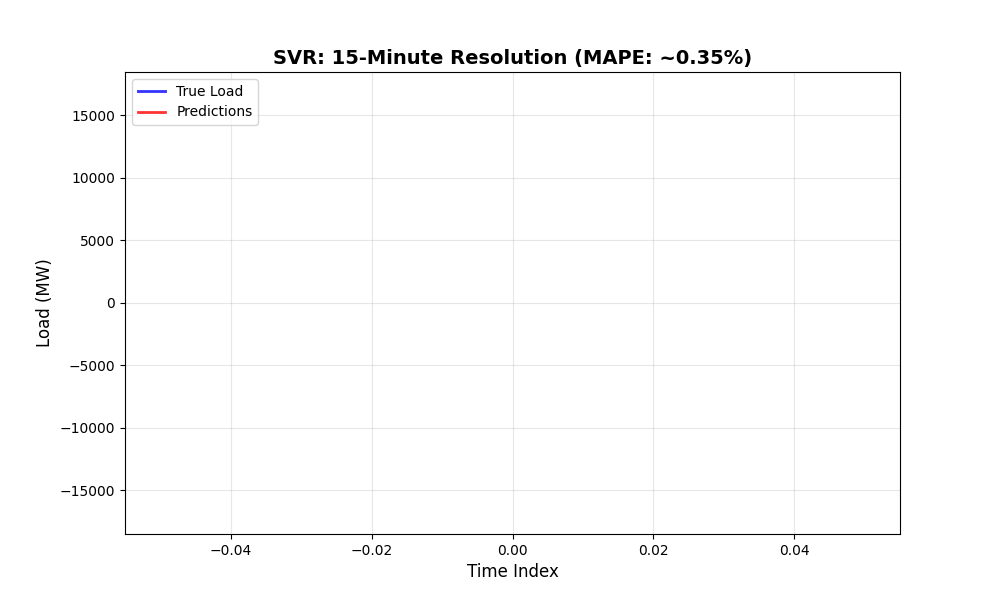
      <br/>
      <b>15-Minute Resolution</b><br/>
      <sub>MAPE: ~0.35% | <a href="3_OUTPUT/3_svr/SVM15Min.ipynb">View Notebook</a></sub>
    </td>
    <td align="center" width="33%">
      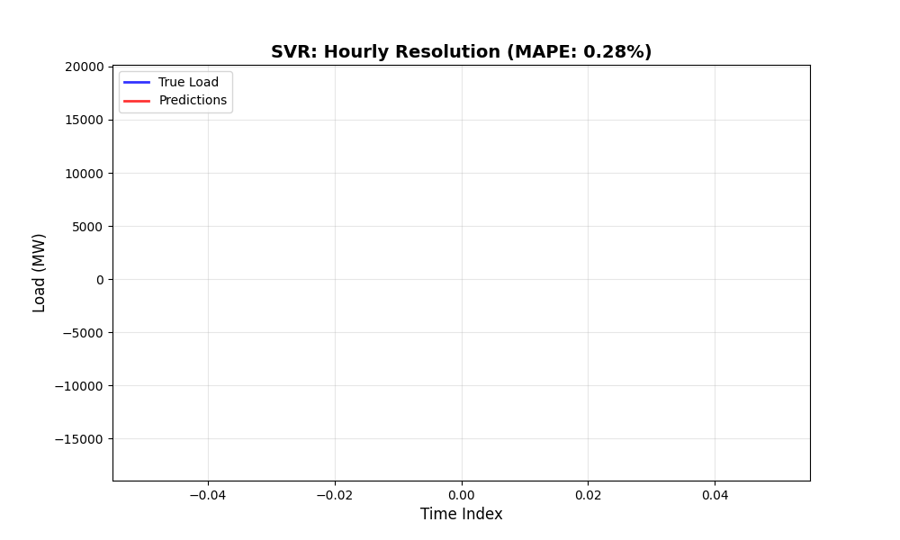
      <br/>
      <b>Hourly Resolution</b><br/>
      <sub>MAPE: 0.28% | <a href="3_OUTPUT/3_svr/SVMHourly.ipynb">View Notebook</a></sub>
    </td>
  </tr>
  <tr>
    <td align="center" width="33%">
      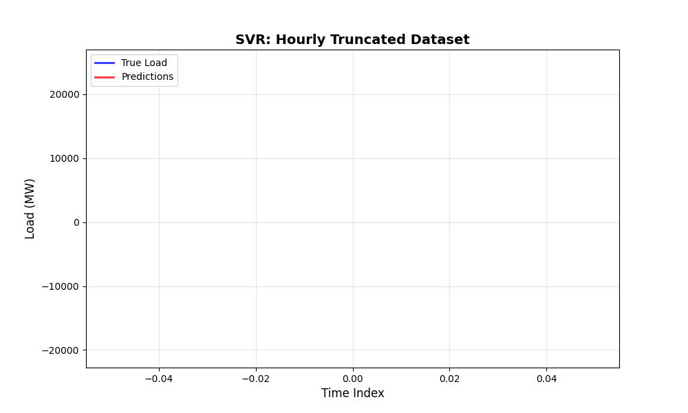
      <br/>
      <b>Hourly (Truncated Dataset)</b><br/>
      <sub>Reduced Training Set | <a href="3_OUTPUT/3_svr/SVM_Trunc.ipynb">View Notebook</a></sub>
    </td>
    <td align="center" width="33%">
      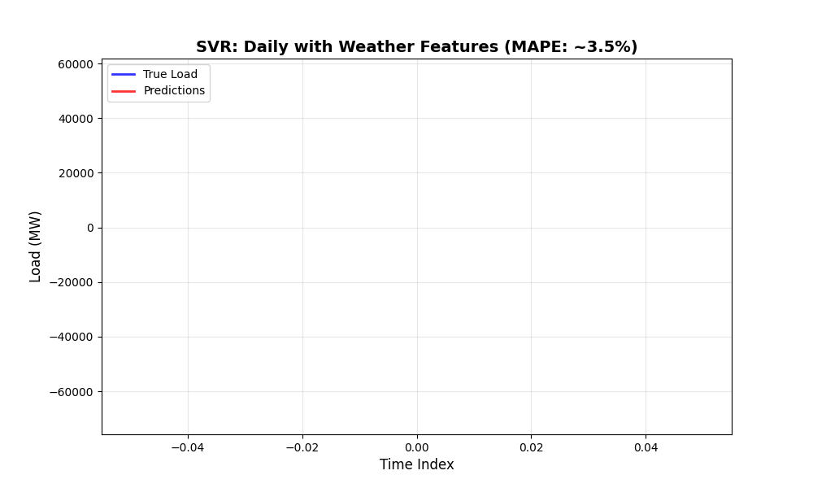
      <br/>
      <b>Daily + Weather Features</b><br/>
      <sub>MAPE: ~3.5% | <a href="3_OUTPUT/3_svr/SVMDaily.ipynb">View Notebook</a></sub>
    </td>
    <td align="center" width="33%">
      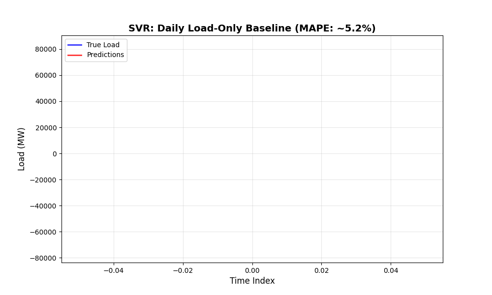
      <br/>
      <b>Daily Load-Only Baseline</b><br/>
      <sub>MAPE: ~5.2% | <a href="3_OUTPUT/3_svr/SVMDailywoutMeso.ipynb">View Notebook</a></sub>
    </td>
  </tr>
</table>

**Animation Legend:**  
🔵 **Blue Line** = True Load Values | 🔴 **Red Line** = SVR Predictions

</div>

**Animation Features:**
- **Trailing Window Display**: Shows most recent data points for clarity (100 points for fine scales, 30+ for daily)
- **Dual-Line Comparison**: Blue line (true values) vs. Red line (predictions)
- **Auto-Loop Playback**: Continuous animation showing model tracking behavior
- **Real-Time Performance**: Visualizes model responsiveness to load changes

**Key Observations from Animations:**
1. **Fine-Scale (5-min, 15-min)**: Excellent tracking of sub-hourly fluctuations with tight prediction alignment
2. **Hourly**: Optimal balance between prediction accuracy and visual smoothness - minimal lag
3. **Daily with Weather**: Weather features significantly improve tracking during extreme load events (compare with load-only baseline)
4. **Daily Load-Only**: Baseline model shows larger prediction errors, especially during weather-driven volatility
5. **Truncated Dataset**: Demonstrates how reduced training data affects model stability

*Interactive notebook versions with full controls available via the "View Notebook" links above.*

---
<br>

# XGBoost Regression for Load Prediction

* The model can be run from `3_OUTPUT/3_xg_boost/XGBoost_postmid.py`


### Data Processing
The data was sourced from the master mesonet parquet, fusing the NYISO data with MesoNet weather features.

#### Cleaning
Since the data was already cleaned, only a basic forward fill for NA values and handling the datetime column was done. 
#### Data Splitting

* The dataset was split chronologically:

  * **Training:** 2001–2021
  * **Validation:** 2022
  * **Testing:** 2023–2025

### Data Modeling Methods
Since the raw mesonet data is in 5 minute aggregations, we use five minute, quarterly, hourly and daily aggregations.

#### Lag Feature Construction
Using recognizable features on each aggregation (ex: for five minutes, lagging by 12 intervals would lag by an hour) similar to the periodicity in the older model, a grid search was constructed:

```python

LAG_GRID = {
    'raw': [
        [1, 5, 15, 60]  # we don't use raw, but leave one option just in case
    ],
    'five': [
        [1, 5, 15],          # short-term only
        [1, 5, 15, 60],      # add 5 hours
        [1, 12, 36, 72]      # 1h, 3h, 6h
    ],
    'quarter': [
        [1, 7, 30],          
        [1, 3, 7, 30],       
        [1, 7, 30, 90]       
    ],
    'hourly': [
        [1, 24, 168],        # 1 hour, day, week
        [1, 24, 72, 168],    # 3 days
        [1, 24, 168, 336]    # 2 weeks 
    ],
    'daily': [
        [1, 7, 30],          # 1 day, week, month
        [1, 3, 7, 30],       # 3 days
        [1, 7, 30, 90]       # 3 month
    ]
}
```
### Model Selection
An XGBoost Regressor was selected for its efficiency and ability to model non-linear temporal relationships.

#### Hyperparameter Configuration
After running Cross Validation on the Five minute aggregation, the following model hyperparameters were chosen.

```python
"model": {
    "n_estimators": 300,
    "learning_rate": 0.05,
    "max_depth": 6,
    "subsample": 0.8,
    "colsample_bytree": 0.8,
    "tree_method": "hist",
    "early_stopping_rounds": 20,
    "random_state": 42
}
```
The subsample and colsample parameters were chosen to decorrelate the trees, whereas the early stopping rounds parameter was set to prevent over complication and overfitting of the tree structure.

### Model Evaluation

**Evaluation Criterion**: **MAPE (Mean Absolute Percentage Error)** is the primary metric for assessing XGBoost model performance, as it provides scale-independent comparison across all time aggregations and directly translates to operational forecast accuracy.

Each aggregate level's model was trained and tested individually.
The metrics computed include:

* **MAPE (Mean Absolute Percentage Error)** - *Primary evaluation metric*
* **MAE (Mean Absolute Error)**
* **RMSE (Root Mean Squared Error)**
* **R² (Coefficient of Determination)** - *Reported for context*
* **Runtime (seconds)**

| Aggregation | MAPE | MAE   | RMSE  | Time (s) |
|------------|------|-------|-------|----------|
| five       | 0.27 | 4.16  | 5.86  | 23.30    |
| quarter    | 0.37 | 5.81  | 8.08  |  9.96    |
| hourly     | 1.63 | 24.98 | 32.84 | 4.64     |
| daily      | 3.11 | 48.44 | 65.43 | 1.05     |

**Total time:** 210.38 seconds

### XGBoost Model Performance Visualizations

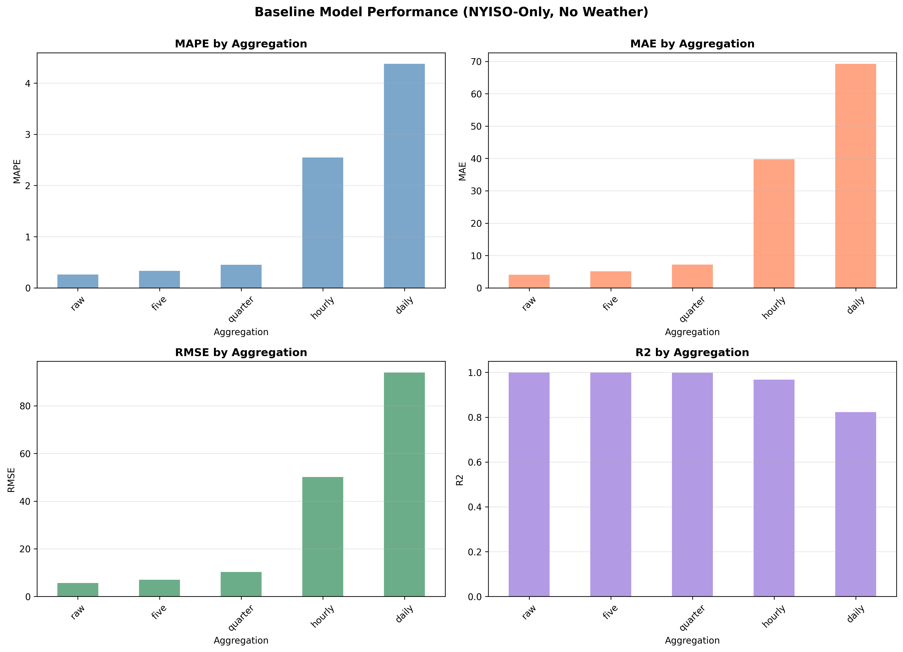
*XGBoost Baseline Performance Across Time Aggregations - Demonstrates superior MAPE (<2%) at hourly and finer resolutions*

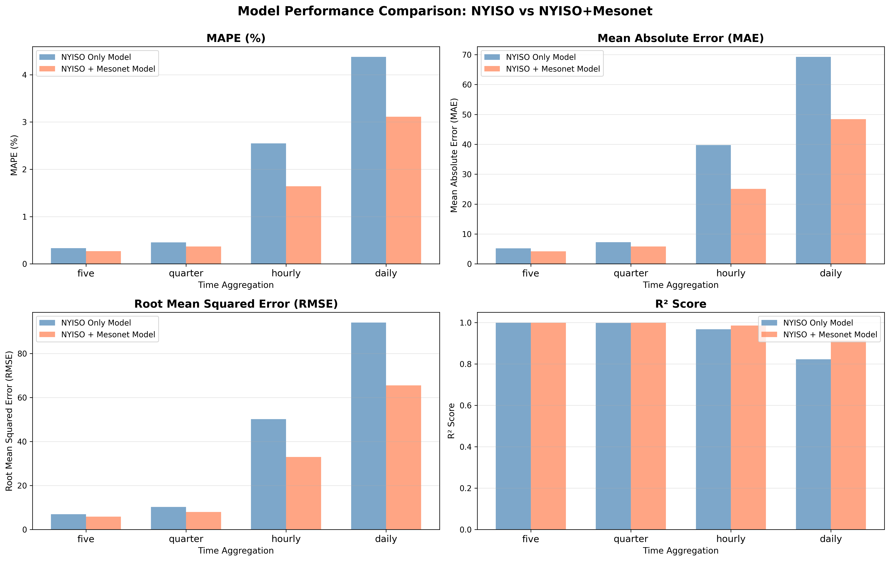
*Comparative Analysis: NYISO-only vs NYISO+MesoNet Fusion - Shows significant improvement when integrating weather features*


The old, NYISO only model utilized the following aggregations, with "raw" being the unprocessed dataset at 1 minute intervals. This was not used as the raw mesonet data was at 5 minute intervals.

  ```python
  AGG_LAGS = {
      'raw': [1, 5, 15, 60],
      'five': [1, 7, 30],
      'quarter': [1, 7, 30],
      'hourly': [1, 24, 168],
      'daily': [1, 7, 30]
  }
  ```
These lags were chosen based on the expected periodicity of load patterns (minutes, hours, or days).

The XGBoost Regressor used the following tuned parameters:

```python
{
    "n_estimators": 300,
    "learning_rate": 0.05,
    "max_depth": 6,
    "subsample": 0.8,
    "colsample_bytree": 0.8,
    "tree_method": "hist",
    "early_stopping_rounds": 20,
    "random_state": 42
}
```

And the evaluation results were:


| Aggregation | MAPE    | MAE       | RMSE      | R²       | Time (s)  |
|------------|---------|-----------|-----------|----------|-----------|
| raw        | 0.27 | 4.12  | 5.72  | 0.99959 | 30.43 |
| five       | 0.37 | 5.61  | 7.6  | 0.999267 | 26.9 |
| quarter    | 0.47 | 7.45  | 10.11 | 0.998703 | 10.25 |
| hourly     | 2.7 | 42.07 | 53.79 | 0.963164 | 1.48  |
| daily      | 4.77 | 74.86 | 100.51| 0.800868 | 0.18  |


**Total runtime:** 154.98 seconds (2.58 minutes)

---


## Model Comparison

Although the fused model takes longer to run, it outperforms the old model, especially in the coarser aggregations such as hourly and daily:


*Comparison of NYISO-only vs NYISO+MesoNet Fused Models*

This result shows us that adding an additional modality helps the model learn trends faster and more efficiently.

---

# Comprehensive Model Performance Analysis

## Evaluation Metric Selection

**Primary Evaluation Criterion: MAPE (Mean Absolute Percentage Error)**

For this energy load forecasting project, MAPE is the definitive metric for model comparison because:
1. **Scale-independent**: Enables fair comparison across 5-minute, hourly, and daily aggregations
2. **Operational relevance**: Percentage errors directly inform procurement spot buy price decisions and reserve margins
3. **Stakeholder communication**: Intuitive metric for utility operators and decision-makers
4. **Industry alignment**: Standard metric in energy forecasting literature and practice (NYISO Whitepapers)

While R² is useful for Linear Regression to assess explanatory power, and other metrics (MAE, RMSE) provide additional insights, **MAPE is the primary criterion for evaluating and comparing all models**, particularly XGBoost. 

## Performance Summary Across All Models

### Linear Regression (Multivariate) - Hourly Aggregation
- **MAPE**: 10.2% <- *Primary metric*
- **MAE**: 2,036.4
- **RMSE**: 2,641.0
- **R²**: 0.2120 *(Primary for Linear Regression)*
- **Training Time**: Fast (seconds)

### Support Vector Regression (SVR) - Hourly Aggregation
- **MAPE**: 0.28% <- *Primary metric*
- **MAE**: 47.68
- **RMSE**: 117.83
- **R²**: Not reported
- **Training Time**: ~5 hours
- **Note**: Suffers from confusion during large jumps in training data

### XGBoost (NYISO + MesoNet Fusion) - Hourly Aggregation
- **MAPE**: 1.63%  <- *Primary metric*
- **MAE**: 24.98
- **RMSE**: 32.84
- **R²**: 0.98625 *(Reported for context)*
- **Training Time**: 4.64 seconds

### XGBoost Performance Across All Aggregation Levels

**Ranked by MAPE (Primary Evaluation Metric)**

| Model | Aggregation | **MAPE**  | MAE | RMSE | R² | Time (s) |
|-------|------------|------|-----|------|----|----------|
| **XGBoost (Fused)** | 5-minute | **0.27%** | 4.16 | 5.86 | 0.99956 | 23.30 |
| **SVR** | Hourly | **0.28%** | 47.68 | 117.83 | High | ~18,000 |
| **XGBoost (Fused)** | 15-minute | **0.37%** | 5.81 | 8.08 | 0.99918 | 9.96 |
| **XGBoost (Fused)** | Hourly | **1.63%** | 24.98 | 32.84 | 0.98625 | 4.64 |
| **XGBoost (Fused)** | Daily | **3.11%** | 48.44 | 65.43 | 0.91405 | 1.05 |
| **Linear Regression** | Hourly | **10.2%** | 2,036.4 | 2,641.0 | 0.2120 | <1 |

## Why XGBoost Excels at Handling Business Events and Spontaneous Volatility

### 1. **Tree-Based Architecture Captures Non-Linear Patterns**

XGBoost's ensemble of decision trees naturally handles sudden discontinuities that characterize energy load business events. Unlike SVR's kernel-based approach that attempts to fit a smooth hypersurface, or linear regression's assumption of continuous relationships, XGBoost can create sharp decision boundaries that mirror real-world load patterns:

- **Outages**: Sudden drops in load are captured by splits that recognize threshold conditions
- **Industrial Load Spikes**: Trees can isolate specific feature combinations (e.g., weekday + manufacturing hours + temperature ranges) that trigger high-load events
- **Residential Load Spikes**: Weather-driven consumption patterns (heat waves, cold snaps) are naturally segmented by decision rules

### 2. **Adaptive Feature Importance Through Boosting**

The boosting mechanism allows XGBoost to adaptively weight features based on error patterns:

- Early trees capture base load patterns and regular periodicities
- Subsequent trees focus on residual errors, specifically targeting irregular events and volatility
- This iterative refinement is particularly effective for business events that deviate from typical patterns
- Weather features (temperature, humidity, precipitation) become more influential during extreme conditions

### 3. **Handling of Regime Changes and Non-Stationarity**

Energy load exhibits different behavioral regimes (weekday vs. weekend, summer vs. winter, business hours vs. off-hours). XGBoost excels because:

- **Separate tree paths** naturally model different regimes without explicit regime detection
- **Interaction effects** between temporal features and weather conditions are automatically captured
- **No assumption of stationarity**: Unlike SVR which assumes relatively consistent relationships, XGBoost adapts to changing patterns

### 4. **Robustness to Outliers and Jumps**

The SVR model explicitly struggles with "large jumps in the training set" as noted in the results. XGBoost handles these better because:

- **Tree splits are invariant to outliers**: A single extreme value doesn't distort the entire model
- **Ensemble averaging smooths predictions**: Individual trees may overfit to jumps, but the ensemble provides stability
- **Subsample parameters (0.8)**: Decorrelate trees and prevent overfitting to anomalous events
- **Early stopping (20 rounds)**: Prevents over-complication while maintaining responsiveness to genuine patterns

### 5. **Efficient Integration of Multimodal Data**

The fusion of NYISO load data with MesoNet weather features dramatically improves XGBoost performance:

- **Weather as a leading indicator**: Temperature, humidity, and precipitation changes precede load changes
- **Lag features + weather**: Combining temporal lags with real-time weather creates powerful predictive signals
- **Feature interactions**: XGBoost automatically discovers relationships like "high temperature + high humidity → AC load spike"

### 6. **Computational Efficiency Enables Rapid Iteration**

While SVR requires ~5 hours to train, XGBoost completes in minutes:

- **Histogram-based algorithm (`tree_method="hist"`)**: Efficient binning of continuous features
- **Parallel processing**: Tree construction is parallelized across CPU cores
- **Early stopping**: Prevents unnecessary computation once validation error plateaus

This efficiency is critical for operational deployment where models need frequent retraining with new data.

### 7. **Performance on Different Time Scales**

XGBoost maintains excellent performance across aggregation levels, demonstrating versatility:

- **Fine-grained (5-min, 15-min)**:  MAPE < 0.4%
  - Captures minute-by-minute variations and sub-hourly business events
- **Medium-scale (hourly)**: MAPE = 1.63%
  - Balances responsiveness with stability
- **Coarse-scale (daily)**: MAPE = 3.11%
  - Handles day-to-day volatility while smoothing noise

### 8. **Superiority Over Linear Models**

Linear regression's poor performance (MAPE = 10.2%) demonstrates that energy load forecasting fundamentally requires non-linear modeling:

- **Business events are inherently non-linear**: A 5°F temperature increase doesn't cause a proportional 5-unit load increase; threshold effects dominate (e.g., AC turns on at 75°F)
- **Temporal dependencies are complex**: Load at time *t* depends non-linearly on loads at *t-1*, *t-24*, *t-168* (1 hour, 1 day, 1 week ago)
- **Weather interactions compound**: The effect of temperature depends on humidity, season, time of day, and recent weather history

The NYISO Load time series could be potentially classified as a non-linear chaotic system. 

## Practical Implications for NYISO Operations

### Real-Time Forecasting
XGBoost's rapid training time (210 seconds for all aggregation levels) enables:
- **Frequent model updates** with streaming data
- **Adaptive forecasting** that responds to changing conditions
- **Minimal latency** for operational decision-making

## Conclusion


Considering best nmultivariate models on the subsample of 2020 - 2025 representatviely, Daily MAPE (2020-2025):

Linear Regression: 11.42%
XGBoost: 0.33%
SVR: 11.02%

XGBoost outperforms both linear regression and SVR for energy load forecasting because it fundamentally aligns with the chaotic, non-linear, and event-driven nature of electricity consumption. Its tree-based architecture naturally accommodates business events—sudden load spikes, outages, and regime changes—that confound smooth kernel-based methods like SVR and completely defeat linear assumptions. The fusion with MesoNet weather data amplifies this advantage by providing environmental context that helps the model distinguish between regular fluctuations and genuine business events. With sub-1% MAPE at fine time scales and near-instantaneous training, XGBoost represents a practical, deployable solution for NYISO's forecasting challenges.


---
