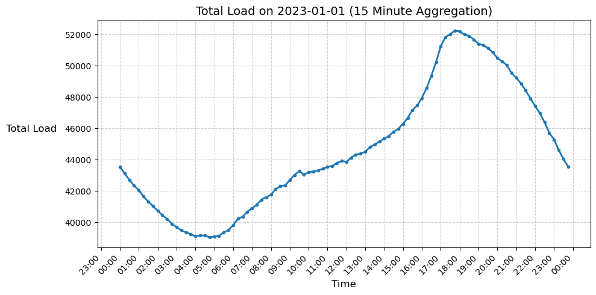

# CS506 Project Midterm Report: Energy Load Forecasting
**Description of the project**

NYISO was birthed out of a catastrophic power outage, costing the American public millions and resulting in deaths. They have their own forecasts (they release publicly and utilize similar methodology as the private utility companies). They oversee all of NY's jurisdictions, with an imperfect picture of (my guess due to poor data sharing common in utilities) of when new load is introduced or removed in addition to other noise. This forecast is important to prevent future catastrophe. 

*NYISO Zones, Source: https://www.nyiso.com/real-time-dashboard.*


Utility companies profit is already negotiated between the state and them in the rate case. They legally cannot charge more for what they buy, they can only charge utility bills for the Distribution and carry over the buying cost. A better forecast would result in less spot buying, and save the ratepayer (the person who pays the utility bill) millions of dollars a day in addition  to further informing NYISO’s important oversight.

Previous forecasts are rooted in a deterministic methodology despite the system acting as a non-linear chaotic environment. An empirical, dynamic, and inductive data-driven approach such as Deep Learning may prove to outcompete current forecasts. Business events, from outages, industrial load spikes, residential load spikes, etc… cause a sudden seemingly-stochastic drop in load. A decision-tree may prevent further error from switching models (such as the criteria of 10% error given a time-period). 

**Clear goal(s) (e.g. Successfully predict the number of students attending lecture based on the weather report).**

There are two main goals of this project:

1. Explore data behavior of NY’s Energy Load (ACF, business events, etc…).
2. **Attempt to outcompete NYISO’s time-series forecasting of Energy Load** on an hourly or more granular scale on an aggregate or zone basis.

## Preliminary Visualizations




## Support Vector Machine Regression Model for Load Prediction
- The model can be ran with 3_OUTPUT/3_svr/SVM_Trunc.ipynb
### Data Processing

The data was queried and aggregated using DuckDB.

``` python
SELECT "Time Stamp", Load
FROM read_parquet('./../../1_LIB/nyiso/nyiso_parquet/**/*.parquet')
```

#### Aggregation and Cleaning
##### Aggregation:
- All regional load values were aggregated by timestamp to compute the total energy loads across regions.

    ``` python
    df_total_load = df.groupby("Time Stamp", as_index=False)["Load"].sum()
    ```

##### DateTime Processesing
- The Time Stamp column was converted to datetime format and resampled to an hourly frequency to obtain hourly average load values.
    ``` python
    df_total_load['Time'] = pd.to_datetime(df_total_load['Time'])
    df_hourly = df_total_load.resample('1H').mean().dropna().reset_index()
    ```
##### Data Splitting
- The dataset was divded chronologically into:
    - Training 2001 - 2021
    - Validation: 2022
    - Testing: 2023 - 2025

### Data Modeling Methods
#### Feature Scaling
- All load values were standardized with StandardScaler from scikit-learn.

    ``` python
    scaler = StandardScaler()
    train_scaled = scaler.fit_transform(train_data)
    val_scaled = scaler.transform(val_data)
    test_scaled = scaler.transform(test_data)
    ```
#### Lag Feature Construction
- Because energy load exhibits temporal dependencies, the model was trained using a sliding window approach with the size of the window being 5. Prediction is based on the values of the past 5 hours.

    ``` python
    TIME_STEPS = 5
    X_train, y_train = create_dataset(train_scaled, train_scaled, TIME_STEPS)
    ```
#### Model Selection
- A support Vector Regression model with a rbf kernel was chosen due to its ability to model non linear relationships between past and future load values.
- Hypterparameter Tuning:
    - A grid search was done over:
        - C in {0.1, 1, 10}
        - gamma in {'scale', 0.01, 0.001}
        - epsilon in {0.01, 0.1, 0.5, 1.0}
    - Grid search was doneon a subset of the training data of size 40000.

    - The best hyperparameters found were:
        - {'C': 10, 'cache_size': 200, 'coef0': 0.0, 'degree': 3, 'epsilon': 0.01, 'gamma': 0.01, 'kernel': 'rbf', 'max_iter': -1, 'shrinking': True, 'tol': 0.001, 'verbose': False}
#### Model Evaluation
- Our current SSVR model profuced the following metrics on Testing Data:
    - Mean Absolute Error (MAE) of 170.34232309986712
    - Root Mean Squared Error (RMSE) of 347.6162200976427
    - Mean Absolute Percentage Error (MAPE) of 1%
    - R^2 Score of 0.9872711260207307 

### Other Observations
- Our current SVR model takes roughly an hour to train. As shown in the upper graph, its predictions largely follow the trends of the true load values. However, as shown in the lower graph there are areas of large jumps that cause the model confusion as it will jump in the proper direction and subsequently jump in the opposite direction. 


---
<br>

## XGBoost Regression for Load Prediction

* The model can be run from `3_OUTPUT/3_xg_boost/XGBoost_testing.py`

### Data Processing

The data was queried and aggregated using DuckDB, sourced from the parquet files stored in
`1_LIB/nyiso/nyiso_parquet/`.

Each parquet file contains timestamped load values for different NYISO regions.

#### Aggregation and Cleaning

##### Aggregation

* All regional load values were filtered by the selected station (e.g., **LONGIL**, **GENESE**, etc) and then resampled to multiple time granularities:

  ```python
  raw = df[['Load']].copy()
  five = raw.resample('5min').sum()
  quarter = raw.resample('15min').sum()
  hourly = raw.resample('1h').sum()
  daily = raw.resample('1d').sum()
  ```
* These resampled datasets allowed the model to evaluate how different temporal resolutions affect prediction performance, identifying cyclic trends in different resolutions.

##### Cleaning

* Duplicate timestamps were dropped after being gathered for the specified station to ensure consistent time indices. This column is then set as index, in datetime format

  ```python
  df['Time Stamp'] = pd.to_datetime(df['Time Stamp'])
  df = df.drop_duplicates(subset=['Time Stamp']).set_index('Time Stamp')
  ```

##### Data Splitting

* The dataset was split chronologically:

  * **Training:** 2001–2021
  * **Validation:** 2022
  * **Testing:** 2023–2025

---

### Data Modeling Methods

#### Lag Feature Construction

* Each aggregate level used different lag windows to capture temporal dependencies:

  ```python
  AGG_LAGS = {
      'raw': [1, 5, 15, 60],
      'five': [1, 7, 30],
      'quarter': [1, 7, 30],
      'hourly': [1, 24, 168],
      'daily': [1, 7, 30]
  }
  ```
* These lags were chosen based on the expected periodicity of load patterns (minutes, hours, or days).
* For example:

  * `raw`: minute-level fluctuations
  * `hourly`: daily and weekly cycles
  * `daily`: long-term seasonal trends

#### Model Selection

* **XGBoost Regressor** was selected for its efficiency and ability to model non-linear temporal relationships.
* It uses **gradient boosting** over decision trees to minimize prediction error iteratively.

#### Hyperparameter Configuration

The model used the following tuned parameters:

```python
{
    "n_estimators": 300,
    "learning_rate": 0.05,
    "max_depth": 6,
    "subsample": 0.8,
    "colsample_bytree": 0.8,
    "tree_method": "hist",
    "early_stopping_rounds": 20,
    "random_state": 42
}
```

#### Model Evaluation

Each aggregate level’s model was trained and tested individually.
The metrics computed include:

* **MAPE (Mean Absolute Percentage Error)**
* **MAE (Mean Absolute Error)**
* **RMSE (Root Mean Squared Error)**
* **R² (Coefficient of Determination)**
* **Runtime (seconds)**

| Aggregation | MAPE  | MAE      | RMSE     | R²     | Time (s) |
| ----------- | ----- | -------- | -------- | ------ | -------- |
| raw         | 0.69  | 14.43    | 23.94    | 0.9986 | 12.74    |
| five        | 3.55  | 100.14   | 456.19   | 0.676  | 6.83     |
| quarter     | 3.41  | 283.15   | 943.72   | 0.814  | 7.65     |
| hourly      | 6.46  | 1823.64  | 2910.58  | 0.875  | 0.52     |
| daily       | 12.77 | 52313.52 | 74073.13 | 0.772  | 0.12     |

**Total runtime:** 188.26 seconds (3.14 minutes)

---

### Other Observations

* **Raw data (no aggregation)** runs the slowest (12.7 s) but gives near-perfect performance since it learns all of the fine-scale dependencies in the data.

* **5-minute and 15-minute aggregations** smooth out high-frequency noise, which reduces precision a lot since the model is not fine enough to pick up details like the raw data but not large enough to capture broader trends but speeds up computation (6.8 and 7.6 s).
* **Hourly aggregation** removes minute-level fluctuations and highlights cyclic variation like day and night peaks. Thus, the model captures long-term structure better (higher R²) but is less precise point-to-point (higher MAPE).
* **Daily aggregation** continues this pattern and outputs a smoother signal, with an R² of about 0.77. However, with fewer samples due to aggregating, the model can’t capture finer variations, thus explaining the higher error values
